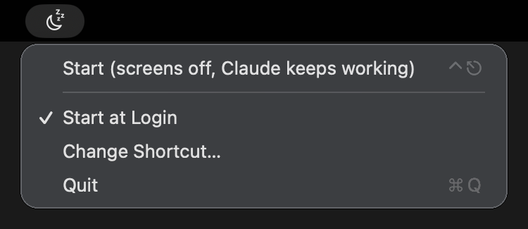

# 🌙 Let Claude Work While You Sleep

Screens off. Mac stays awake. Claude keeps working.

- 🖥️ **Screens off, instantly**: press **⌃Esc** from any app, or pick **Start** from the menu bar.
- ⚡ **Mac stays awake**: it's not sleeping, it's *resting its eyes*. Your apps keep running.
- 🖱️ **Back in a second**: move the mouse or press a key. Screens return, normal sleep rules too.
- 🔓 **No password in the morning**: screens go dark instead of off, so macOS doesn't lock. Turn off **Keep Unlocked** in the menu to lock as usual.
- ⌨️ **Your shortcut**: pick **Change Shortcut…** and press any combo you like.
- 🚀 **Start at Login**: always there when you need it.
- 🪶 **Tiny**: lives quietly in the menu bar. No Dock icon, no windows.

## Screenshot



## Install

```sh
brew install --cask iosifnicolae2/tap/let-claude-work && open -a LetClaudeWork
```

## Uninstall

```sh
brew uninstall --cask let-claude-work
```
